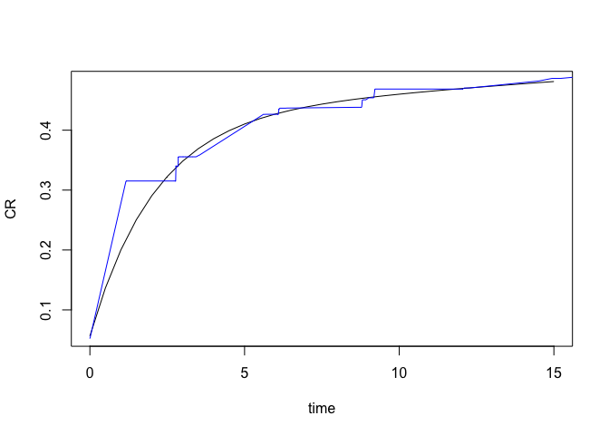
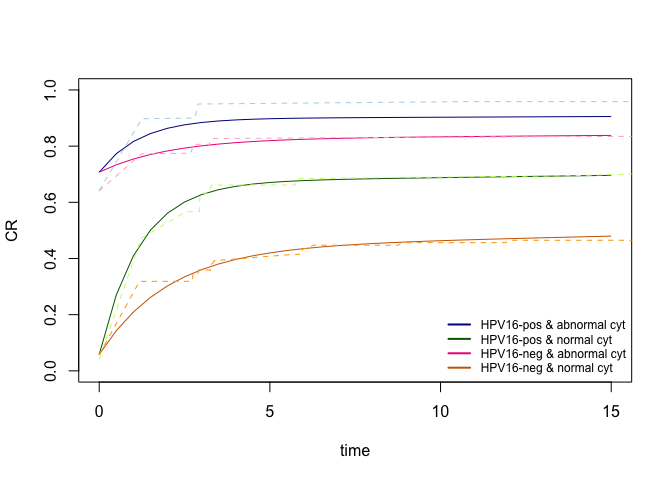

<!-- README.md is generated from README.Rmd. Please edit that file -->

# PI3M

<!-- badges: start -->
<!-- badges: end -->

This `R` package fits our prevalence-incidence mixture model to
interval-censored data to estimate the cumulative disease risk in a
population with a temporarily elevated risk of disease, e.g., risk of
CIN2+ in HPV-positive women.

In longitudinal screening studies it is possible to observe prevalent,
early or late events during follow-up. In our model, early events are
modelled via a competing risks framework, infections either progress to
the disease state or to a (latent) “clearance” state (i.e. viral
clearance) at constant rates. Subjects without the high-risk condition
may also develop disease which is modelled by adding background risk.
Parameters can depend on individual risk factors and are estimated with
an expectation-maximisation (EM) algorithm with weakly informative
Cauchy priors. More details are given in the accompanying paper.

There are five main functions in this package:

- `PI3M.fit`: fits our Prevalence-Incidence-Cure model
- `PI3M.predict`: makes predictions from the model
- `PI3M.simulator`: simulates data under user-specified parameter values
  and covariates
- `score.test.gamma`: performs a score test whether the shape parameter
  of the Gamma distribution for progression is equal to one or not.
- `simulator.gamma`: simulates data where progression follows a Gamma
  rather than exponential distribution and so can have a shape parameter
  not equal to one. Does not allow for covariates, yet.

## Installation

You can install the most recent version of `PI3M` from
[GitHub](https://github.com/) with:

``` r
# install.packages("devtools")
devtools::install_github("kelsikroon/PI3M")
```

## Examples

This is a basic example in a setting without covariates which
illustrates how to simulate data, fit the model, make predictions from
the plot and compare to a non-parametric cumulative incidence curve:

``` r
library(PI3M)
sim.thetas <- c(-5, -1.6, -1.2, -3)
sim.dat <- PI3M.simulator(1000, params = sim.thetas, show_prob = 0.9, interval=3, include.h=T)
head(sim.dat) # view simulated data
#>       left    right z      age    age.std hpv cyt cause      actual
#> 1 24.05106      Inf 0 30.01140 -0.8806798   0   1     3 145.4337670
#> 2 23.92914      Inf 0 41.21616 -0.3909981   0   0     3 466.5605242
#> 3  0.00000 2.956186 0 57.36062  0.3145629   0   1     2   0.1538514
#> 4  0.00000 3.149824 0 67.95342  0.7774999   0   0     2   1.3967439
#> 5  0.00000 3.070883 0 33.63634 -0.7222592   0   1     2   1.4100571
#> 6  0.00000 3.131835 0 63.74236  0.5934641   0   1     2   0.9391358
```

``` r

sim.fit <- PI3M.fit(data=sim.dat) # fit model to simulated data
sim.fit$summary # view model fit summary
#>        param theta.hat std.dev   lower   upper
#> h          h   -4.9700  0.1576 -5.2789 -4.6611
#> g0 intercept   -1.6964  0.0865 -1.8659 -1.5268
#> w0 intercept   -1.2503  0.1066 -1.4592 -1.0414
#> p0 intercept   -2.8194  0.1417 -3.0971 -2.5417
```

``` r

sim.predict <- PI3M.predict(data=sim.dat[1,], time.points = seq(0, 15, 0.5), fit=sim.fit)

library(survival) # compare model fit to non-parametric Kaplan-Meier curve 
sim.km.fit <- survfit(Surv(sim.dat$left, sim.dat$right, type='interval2')~1)

# plot PI3M predictions and KM-curve to compare 
plot(sim.predict[[1]]$Time, sim.predict[[1]]$CR, type='l', xlab='time', ylab='CR')
lines(sim.km.fit$time, 1-sim.km.fit$surv, col='blue')
```



To add covariates to the model we specify them separately for the
progression, clearance, and prevalence parameters. For example if we
wanted to add HPV16 as a covariate for progression and abnormal cytology
as a covariate for prevalence then we would do the following:

``` r

sim.thetas.cov <- c(-5, -1.6, 1, -1.2, -3, 4)
sim.dat2 <- PI3M.simulator(1000, prog_model = "prog ~ hpv", prev_model = "prev ~ cyt", sim.thetas.cov, show_prob = 0.9, interval=3, include.h=T)
head(sim.dat2) # view simulated data
#>       left right z      age    age.std hpv cyt cause    actual
#> 1 24.43957   Inf 0 41.00293 -0.3533606   0   0     3  30.22738
#> 2 23.96993   Inf 0 42.72042 -0.2795450   0   1     3  68.78136
#> 3 23.79873   Inf 0 31.39774 -0.7661805   0   0     3  55.06976
#> 4 23.97502   Inf 0 63.23069  0.6019628   0   1     3 267.92372
#> 5  0.00000     0 1 57.67462  0.3631694   1   1     1   0.00000
#> 6  0.00000     0 1 64.95699  0.6761575   1   1     1   0.00000
```

``` r

sim.fit2 <- PI3M.fit(sim.dat2, prog_model = "prog ~ hpv", prev_model = "prev ~ cyt") # fit model to simulated data
sim.fit2$summary # view model fit summary
#>        param theta.hat std.dev   lower   upper
#> h          h   -5.2486  0.2081 -5.6565 -4.8407
#> g0 intercept   -1.6235  0.1061 -1.8315 -1.4156
#> g1       hpv    1.0179  0.1483  0.7273  1.3086
#> w0 intercept   -1.2276  0.1036 -1.4306 -1.0245
#> p0 intercept   -2.7809  0.1826 -3.1388 -2.4231
#> p1       cyt    3.6627  0.2137  3.2438  4.0815
```

``` r

sim.predict2 <- PI3M.predict(data=data.frame(hpv = c(1, 1, 0, 0), cyt=c(1, 0, 1, 0)), 
                              time.points = seq(0, 15, 0.5), fit=sim.fit2)

# compare model fit to non-parametric Kaplan-Meier curve 
sim.km.fit1 <- survfit(Surv(left, right, type='interval2')~1, data = sim.dat2[sim.dat2$hpv==1 & sim.dat2$cyt==1,])
sim.km.fit2 <- survfit(Surv(left, right, type='interval2')~1, data = sim.dat2[sim.dat2$hpv==1 & sim.dat2$cyt==0,])
sim.km.fit3 <- survfit(Surv(left, right, type='interval2')~1, data = sim.dat2[sim.dat2$hpv==0 & sim.dat2$cyt==1,])
sim.km.fit4 <- survfit(Surv(left, right, type='interval2')~1, data = sim.dat2[sim.dat2$hpv==0 & sim.dat2$cyt==0,])
```

``` r
# plot PI3M predictions and KM-curve to compare 
plot(sim.predict2[[1]]$Time, sim.predict2[[1]]$CR, type='l', xlab='time', ylab='CR', ylim=c(0,1), col='darkblue')
lines(sim.km.fit1$time, 1-sim.km.fit1$surv, col='lightblue', lty=2)

lines(sim.predict2[[2]]$Time, sim.predict2[[2]]$CR, col = 'darkgreen')
lines(sim.km.fit2$time, 1-sim.km.fit2$surv, col='darkolivegreen1', lty=2)

lines(sim.predict2[[3]]$Time, sim.predict2[[3]]$CR,col='deeppink2')
lines(sim.km.fit3$time, 1-sim.km.fit3$surv, col='pink1', lty=2)

lines(sim.predict2[[4]]$Time, sim.predict2[[4]]$CR, col='darkorange3')
lines(sim.km.fit4$time, 1-sim.km.fit4$surv, col='orange1', lty=2)

legend("bottomright",
         legend=c("HPV16-pos & abnormal cyt", "HPV16-pos & normal cyt", "HPV16-neg & abnormal cyt", "HPV16-neg & normal cyt"),
         col=c("darkblue", "darkgreen", "deeppink2", "darkorange3"), lty=1, lwd=2, bty = "n", cex=0.75)
```



## Authors

- **Kelsi R. Kroon** <k.kroon@amsterdamumc.nl> /
  <kelsikroon@outlook.com>
